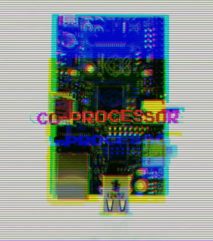
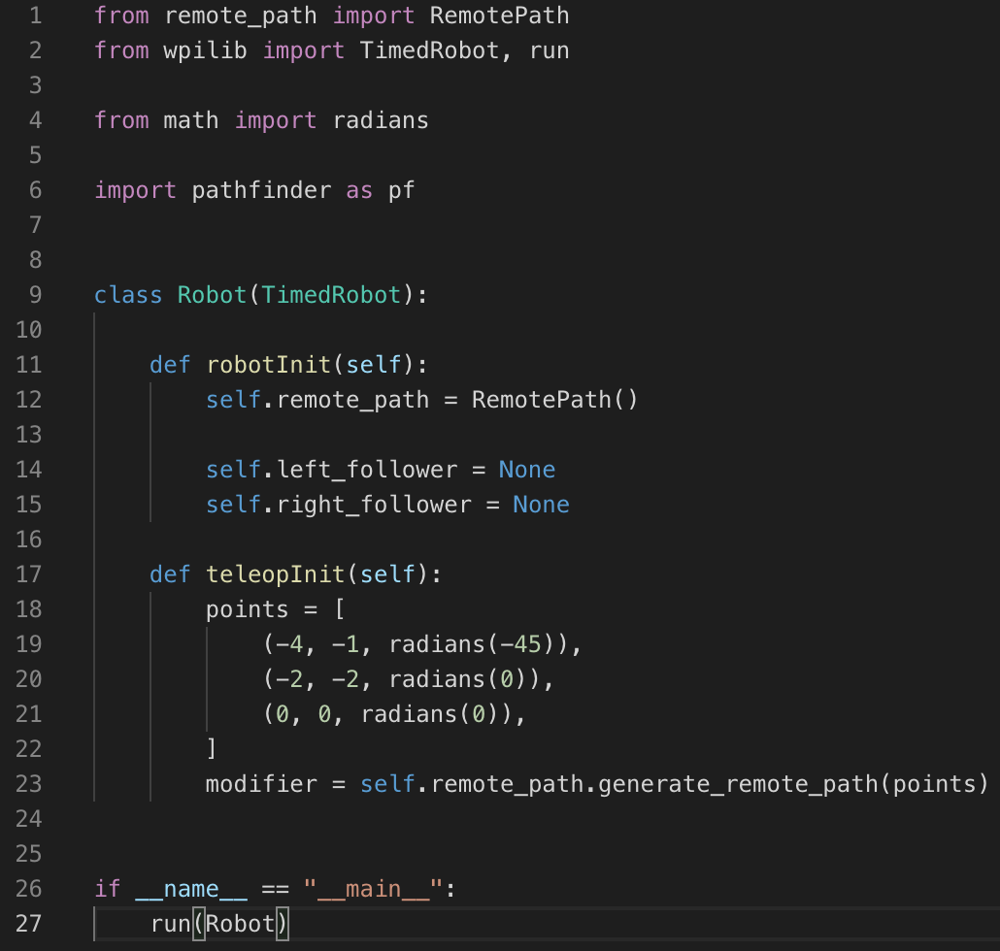
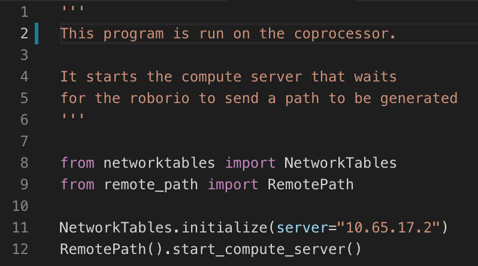

# Off-board path generation




Because Pathfinder has an underlying C++ backend, it needs to be compiled. This is horribly slow on the RoboRIO, due to the heavy lifting involved in the compilation in linking process. The RoboRIO simply isn't made for it.

> This makes generating motion profiles and trajectories for our robot just-in-time nearly impossible. During our tests, the generation process could take over ***4 minutes***. This was unacceptable.

Which is why we wrote the `remote-path` library.

Here's some example code utilizing `remote-path`.



All we have to do to use this is run our `server.py` program.



> Using this, we can generate a path that took ~120 seconds, in *0.05 seconds*. In addition, other FRC teams' coprocessors were taking up to 10 seconds to generate a path.


> Now that we have a tool to generate paths remotely, we can write a wrapper around it to make it interact with our robot in a more human readable way.


With a bit of abstraction, we can now autonomous code for our bot like this.

```python
    def autonomousInit(self):
        self.chassis.reset_sensors()
        self.elevator.reset_sensors()
        self.elevator.zero()

        # Define a queue of tasks for the robot to follow,
        # also called a `Path` in our robot code
        self.path = Path(self,
            GrabHatch(), # Grab a hatch

            Trajectory([
                (0, 0, radians(0)),
                (8.5, -7, radians(-90))
            ]), # Go exactly 8.5 feet forward, 7 feet right,
                # with an exit angle of -90 degrees.

            DropHatch() # Drop the hatch
        )

    def autonomousPeriodic(self):
        if not self.path.is_done():
            self.path.update(self)
```


> With this, our autonomous routines are very easy to debug, and extremely easy to change on the fly.