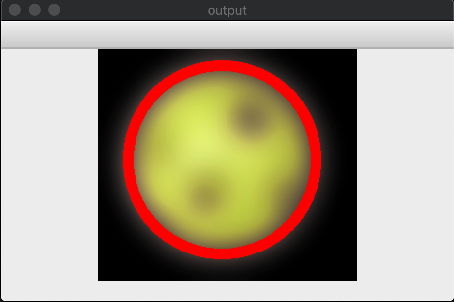
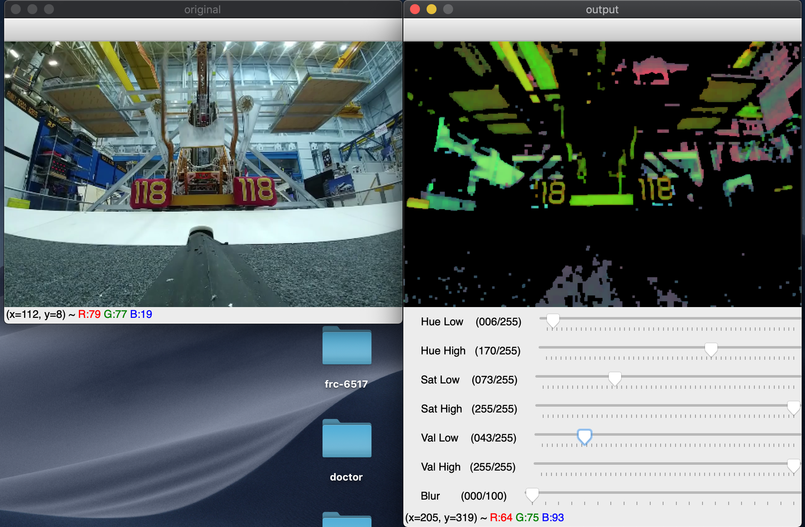

# small-vision


> Small Vision is our team's own vision processing library. It's built on top of OpenCV v4.0.0, but it's meant to be much more programmer friendly.


Using nearly *4 to 5 times less code*, a programmer can write powerful and debuggable vision processing programs.

For example, here's a program that detects fuel from the 2017 frc game, Steamworks.
```python
import cv2
from small_vision import *

image = cv2.imread("fuel.png", 1) # Read an image with opencv


# show untouched image
# convert to HSV
original = Image(image).show("original").convert_to_hsv()

# HSV mask for neon yellow
mask = original.get_mask(
    [27, 100, 100],
    [40, 255, 255]
)

# apply mask
# blur 100%
# draw circle around the largest blob
# convert back to BGR
# show image
original.mask(mask).blur(1).draw_target(mask).convert_to_bgr().show("output")


wait_for_keypress()
exit()
```

Now, here's its output.



Here's an example program written using `small-vision` to detect robots and detect last year's game's cubes.

```python
import cv2
from small_vision import *

def main():
    cap = cv2.VideoCapture("video.mp4")

    while True:
        # Get the image from camera 0
        _, image = cap.read()
        image = Image(image).resize((480, 320))

        original = image.clone()


        x, y, radius = get_closest_red_bot(image.clone())
        if radius > 8:
            original.draw_text(
                (
                    x-radius/original.get_width(),
                    y-radius/original.get_height()
                ), 'Red Bot', color=(255, 0, 0))


        cubes = get_cubes(image.clone())
        for x, y, radius in cubes:
            original.draw_text(
                (
                    x-radius/original.get_width(),
                    y-radius/original.get_height()
                ), 'Cube', color=(0, 0, 255))
        
        original.show("overlay")

        if escape_key_pressed():
            break

    exit()


def get_closest_red_bot(image):
    mask = image.get_mask(
        [0, 20, 100],
        [59, 43, 255]
    )

    return image.mask(mask).smooth().blur(0.5).get_largest_blob(mask)
    

def get_cubes(image):
    mask = image.convert_to_hsv().get_mask(
        [25, 142, 191],
        [35, 255, 255]
    )
    
    return filter(lambda t: t[2] > 10, image.mask(mask).smooth().blur(0.5).convert_to_bgr().get_blobs(mask))


if __name__ == "__main__":
    main()
```

Here's a demo of what that code does.


Another example using sliders.

```python
import cv2, time
from small_vision import *

window = Window("output").add_slider("Hue Low", 30, 255).add_slider("Hue High", 65, 255).add_slider("Sat Low", 120, 255).add_slider("Sat High", 255, 255).add_slider("Val Low", 100, 255).add_slider("Val High", 255, 255).add_slider("Blur", 0, 100)

cap = cv2.VideoCapture("video.mp4")

while True:
    _, image = cap.read()
    image = Image(image).resize((480, 320))


    output = image.clone().convert_to_hsv()
    hl, hh, sl, sh, vl, vh, blur = window.get_sliders()

    mask = output.get_mask(
        [hl, sl, vl],
        [hh, sh, vh]
    )

    image.show("original")
    output.mask(mask).smooth().blur(blur/100).show("output")

    time.sleep(0.05)

    if escape_key_pressed():
        break

exit()
```




> OpenCV is very unreadable and hard to understand. However, using this library to interact with OpenCV, we can build applications that are much more complex with much less effort than is required with OpenCV.

Because of this, it acts as the foundation of our position estimation code.